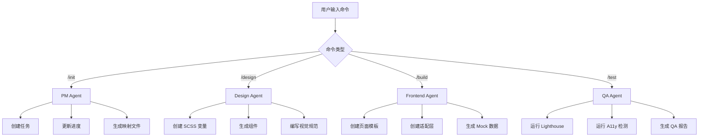

# Claude Agents 系统说明

本项目使用 **MCP (Model Context Protocol)** 实现了完整的 Multi-Agent 系统。

## 🤖 Agent 架构

### 四个专业化 Agent

| Agent | 文件 | 职责 | 工具 |
|-------|------|------|------|
| **PM Agent** | `pm-agent.js` | 项目管理 | create_task, update_task, get_progress, update_progress, create_page_map, create_entity_map |
| **Design Agent** | `design-agent.js` | 设计系统 | create_scss_variables, create_component, create_visual_guidelines, generate_color_palette, generate_typography_system |
| **Frontend Agent** | `frontend-agent.js` | 前端开发 | create_page_template, create_route, create_schema_map, create_api_client, create_mock_data, create_i18n_file |
| **QA Agent** | `qa-agent.js` | 质量保障 | run_lighthouse, run_a11y_check, run_seo_check, generate_report, check_performance, validate_i18n |

---

## 📂 文件结构

```
.claude/
├── README.md                # 本说明文件
├── mcp-servers.json         # MCP 服务器配置
├── agents/                  # Agent 脚本目录
│   ├── pm-agent.js          # PM Agent
│   ├── design-agent.js      # Design Agent
│   ├── frontend-agent.js    # Frontend Agent
│   └── qa-agent.js          # QA Agent
└── commands/                # Slash Commands
    ├── init.md              # /init 命令
    ├── design.md            # /design 命令
    ├── build.md             # /build 命令
    └── test.md              # /test 命令
```

---

## 🚀 使用方式

### 方式 1: 使用 Slash Commands（推荐新手）

直接输入以下命令：

```
/init    # 启动 Phase 1 项目初始化
/design  # 启动 Phase 2 UI Kit 建立
/build   # 启动 Phase 3+4 模板实现与适配层
/test    # 启动 Phase 5 质量保障
```

### 方式 2: 直接调用 MCP Agent（高级用法）

Claude Code 会自动加载 `.claude/mcp-servers.json` 中定义的 Agent。

你可以直接请求：
```
请使用 PM Agent 创建页面映射文件
请使用 Design Agent 生成 SCSS 变量体系
请使用 Frontend Agent 创建首页模板
请使用 QA Agent 运行 Lighthouse 测试
```

---

## 🔧 Agent 工具详解

### PM Agent 工具

| 工具 | 参数 | 功能 |
|------|------|------|
| `create_task` | taskId, title, description, priority, phase | 在 TASKS.md 中创建新任务 |
| `update_task` | taskId, status | 更新任务状态（pending/in_progress/completed/blocked） |
| `get_progress` | - | 获取项目进度 |
| `update_progress` | phase, milestone, notes | 更新项目进度记录 |
| `create_page_map` | pages | 创建页面映射文件 |
| `create_entity_map` | entities | 创建实体关系映射 |

### Design Agent 工具

| 工具 | 参数 | 功能 |
|------|------|------|
| `create_scss_variables` | colors, fonts, spacing | 创建 SCSS 变量文件 |
| `create_component` | name, type, template | 创建 Svelte 组件 |
| `create_visual_guidelines` | content | 创建视觉规范文档 |
| `generate_color_palette` | - | 生成品牌色彩系统 |
| `generate_typography_system` | - | 生成字体系统 |

### Frontend Agent 工具

| 工具 | 参数 | 功能 |
|------|------|------|
| `create_page_template` | name, route, template | 创建页面模板 |
| `create_route` | route, loadFunction | 创建路由配置 |
| `create_schema_map` | mappings | 创建 schema-map.json |
| `create_api_client` | code | 创建 API 客户端 |
| `create_mock_data` | entity, data | 创建 Mock 数据 |
| `create_i18n_file` | locale, translations | 创建多语言文件 |

### QA Agent 工具

| 工具 | 参数 | 功能 |
|------|------|------|
| `run_lighthouse` | url, device | 运行 Lighthouse 测试 |
| `run_a11y_check` | url | 运行 A11y 可访问性检测 |
| `run_seo_check` | url | 运行 SEO 验证 |
| `generate_report` | reportType, data | 生成综合报告 |
| `check_performance` | metrics | 检查性能指标 |
| `validate_i18n` | - | 验证多语言完整性 |

---

## 🧪 测试 Agent

### 测试 PM Agent
```bash
echo '{"jsonrpc":"2.0","method":"initialize","id":1}' | node .claude/agents/pm-agent.js
```

### 测试 Design Agent
```bash
echo '{"jsonrpc":"2.0","method":"initialize","id":1}' | node .claude/agents/design-agent.js
```

### 测试 Frontend Agent
```bash
echo '{"jsonrpc":"2.0","method":"initialize","id":1}' | node .claude/agents/frontend-agent.js
```

### 测试 QA Agent
```bash
echo '{"jsonrpc":"2.0","method":"initialize","id":1}' | node .claude/agents/qa-agent.js
```

---

## 📊 Agent 协作流程



---

## 🔄 Agent 状态管理

每个 Agent 都是**无状态的**，通过文件系统持久化状态：

| Agent | 状态存储位置 |
|-------|-------------|
| PM Agent | `TASKS.md`, `docs/project-progress.md` |
| Design Agent | `ui-kit/`, `docs/visual-guidelines.md` |
| Frontend Agent | `src/`, `adapter/`, `locales/` |
| QA Agent | `qa/reports/` |

---

## ⚡ 性能优化

### Agent 并行执行
多个 Agent 可以并行工作：
```
同时请求 Design Agent 和 Frontend Agent：
- Design Agent 创建组件
- Frontend Agent 创建页面模板
```

### Agent 缓存
Agent 输出的文件会被缓存，避免重复生成。

---

## 🐛 调试

### 查看 Agent 日志
```bash
node .claude/agents/pm-agent.js 2>&1 | tee pm-agent.log
```

### 手动测试工具
```bash
echo '{
  "jsonrpc": "2.0",
  "method": "tools/call",
  "params": {
    "name": "create_task",
    "arguments": {
      "taskId": "1.13",
      "title": "测试任务",
      "description": "这是一个测试",
      "priority": "P0",
      "phase": "Phase 1"
    }
  },
  "id": 2
}' | node .claude/agents/pm-agent.js
```

---

## 📚 相关文档

- [CLAUDE.md](../CLAUDE.md) - 项目定义文件
- [AGENTS.md](../AGENTS.md) - Agent 角色文档
- [TASKS.md](../TASKS.md) - 任务注册表
- [MCP 协议文档](https://spec.modelcontextprotocol.io/)

---

**创建日期**: 2025-11-04
**版本**: v1.0
**维护**: Claude Code Agents
