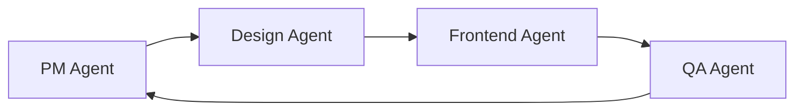
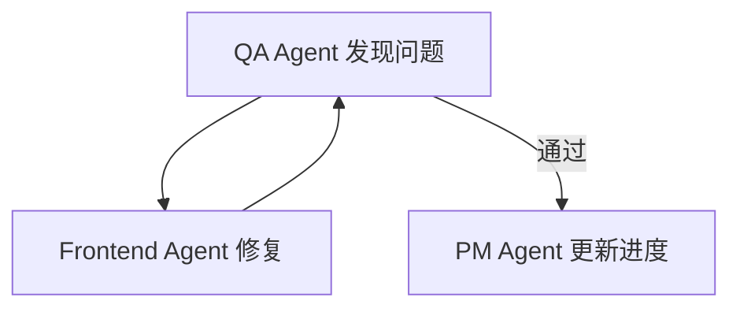

# Claude Agents 协作配置

## Agent 总览

本项目采用 **四个专业化 Agent** 协同工作模式：

| Agent | 角色 | 主要职责 | 输出目录 |
|-------|------|---------|---------|
| **PM Agent** | 项目经理 | 任务规划、进度追踪、文档管理 | `/docs` |
| **Design Agent** | 设计系统 | UI 组件库、视觉规范、样式体系 | `/ui-kit` |
| **Frontend Agent** | 前端开发 | 页面模板、路由、后台适配 | `/src` `/adapter` |
| **QA Agent** | 质量保障 | 性能测试、A11y 检测、报告生成 | `/qa` |

---

## 1. PM Agent (项目经理)

### 职责范围
- 📋 制定项目任务清单 (TASKS.md)
- 📊 维护项目进度表 (docs/project-progress.md)
- 🗺️ 生成页面结构映射 (docs/page-map.json)
- 🔗 生成实体关系映射 (docs/entity-relations.json)
- 📝 编写项目文档与规范

### 核心任务
1. **Phase 1**: 项目初始化
   - 创建 CLAUDE.md
   - 创建 AGENTS.md
   - 创建 TASKS.md
   - 建立项目目录结构

2. **Phase 2-5**: 进度追踪
   - 每个 Phase 结束后更新 project-progress.md
   - 记录完成情况、遇到的问题、解决方案
   - 维护任务优先级

### 输出文件
```
docs/
├── project-progress.md       # 项目进度表
├── page-map.json             # 页面映射表
├── entity-relations.json     # 实体关系图
└── architecture.md           # 架构文档
```

### 协作方式
- **触发时机**: 每个 Phase 开始与结束
- **协作对象**: 所有 Agents
- **沟通方式**: 通过 TASKS.md 分配任务

---

## 2. Design Agent (设计系统)

### 职责范围
- 🎨 建立 SCSS 变量体系 (ui-kit/styles/variables.scss)
- 🧩 创建 UI 组件库 (ui-kit/components/)
- 📐 编写视觉规范文档 (docs/visual-guidelines.md)
- 🖼️ 定义组件使用规范

### 核心任务
1. **Phase 2**: UI Kit 建立
   - 创建 SCSS 变量体系 (颜色、字体、间距)
   - 实现基础组件 (Typography / Button / Card / Input)
   - 实现页面级组件 (Hero / Footer / Navigation)
   - 编写组件使用文档

### 组件清单
```
ui-kit/components/
├── base/                     # 基础组件
│   ├── Typography.svelte
│   ├── Button.svelte
│   ├── Card.svelte
│   ├── Input.svelte
│   └── Link.svelte
│
├── layout/                   # 布局组件
│   ├── Hero.svelte
│   ├── Footer.svelte
│   ├── Navigation.svelte
│   └── Section.svelte
│
└── domain/                   # 业务组件
    ├── LawyerCard.svelte
    ├── NewsCard.svelte
    ├── PracticeCard.svelte
    └── ContactForm.svelte
```

### 样式规范
```scss
// ui-kit/styles/variables.scss
$color-primary: #0E1B3A;      // 深蓝
$color-secondary: #B5975A;    // 金色
$color-text: #2C3E50;         // 深灰
$color-background: #F5F7FA;   // 浅灰

$font-family-cn: 'Noto Sans SC', sans-serif;
$font-family-en: 'Inter', sans-serif;

$spacing-xs: 8px;
$spacing-sm: 16px;
$spacing-md: 24px;
$spacing-lg: 32px;
$spacing-xl: 48px;
```

### 协作方式
- **触发时机**: Phase 2 启动时
- **协作对象**: Frontend Agent (提供组件给前端使用)
- **沟通方式**: 通过组件 API 文档

---

## 3. Frontend Agent (前端开发)

### 职责范围
- 🏗️ 实现页面模板 (src/routes/)
- 🔌 开发后台适配层 (adapter/)
- 🌍 实现多语言支持 (locales/)
- 🔄 配置路由与数据加载

### 核心任务
1. **Phase 3**: 模板实现
   - 实现 8 类核心模板
   - 配置 SvelteKit 路由
   - 实现数据加载逻辑
   - 实现交叉引用链接

2. **Phase 4**: 后台适配
   - 编写 schema-map.json
   - 实现 API 客户端
   - 创建 Mock 数据
   - 测试数据流

### 模板清单
```
src/routes/
├── +page.svelte              # 首页
├── about/
│   └── +page.svelte          # 关于我们
├── practices/
│   ├── +page.svelte          # 业务领域列表
│   └── [slug]/
│       └── +page.svelte      # 业务领域详情
├── team/
│   ├── +page.svelte          # 律师列表
│   └── [id]/
│       └── +page.svelte      # 律师详情
├── news/
│   ├── +page.svelte          # 新闻列表
│   └── [id]/
│       └── +page.svelte      # 新闻详情
├── events/
│   ├── +page.svelte          # 活动列表
│   └── [id]/
│       └── +page.svelte      # 活动详情
├── careers/
│   └── +page.svelte          # 招贤纳士
├── contact/
│   └── +page.svelte          # 联系我们
└── search/
    └── +page.svelte          # 搜索结果
```

### 适配层结构
```
adapter/
├── schema-map.json           # 字段映射表
├── api-client.ts             # API 客户端
├── types.ts                  # 类型定义
└── mock-data/
    ├── lawyers.json
    ├── news.json
    ├── practices.json
    └── events.json
```

### 协作方式
- **触发时机**: Phase 3 启动时
- **协作对象**: Design Agent (使用 UI Kit 组件)
- **沟通方式**: 通过组件 import

---

## 4. QA Agent (质量保障)

### 职责范围
- 🚀 执行 Lighthouse 性能测试
- ♿ 执行 A11y 可访问性测试
- 🔍 执行 SEO 优化验证
- 📊 生成测试报告

### 核心任务
1. **Phase 5**: 性能验证与优化
   - 运行 Lighthouse CI
   - 运行 A11y 检测工具
   - 验证 SEO 标签完整性
   - 测试国际访问速度
   - 生成综合报告

### 测试清单
```yaml
性能测试 (Lighthouse):
  - Performance: ≥ 90
  - SEO: ≥ 95
  - Accessibility: ≥ 90
  - Best Practices: ≥ 90

可访问性测试:
  - ARIA 标签完整性
  - 键盘导航可用性
  - 色彩对比度
  - 屏幕阅读器兼容

SEO 验证:
  - Meta 标签
  - hreflang 标签
  - Structured Data (JSON-LD)
  - Sitemap.xml
  - robots.txt

多语言测试:
  - 中英文切换
  - URL 路由正确性
  - 语言文件完整性
```

### 输出文件
```
qa/
├── scripts/
│   ├── lighthouse.js         # Lighthouse 测试脚本
│   ├── a11y-check.js         # A11y 检测脚本
│   └── seo-check.js          # SEO 验证脚本
│
└── reports/
    ├── lighthouse-summary.json
    ├── a11y-report.json
    ├── seo-report.json
    └── final-qa-report.md
```

### 协作方式
- **触发时机**: Phase 5 启动时
- **协作对象**: Frontend Agent (提出优化建议)
- **沟通方式**: 通过测试报告反馈

---

## Agent 协作流程

### 线性流程 (Phase 1-5)


### 迭代流程 (优化阶段)


---

## Agent 调用方式

### 在 Claude Code 中调用
```bash
# 启动项目初始化
/init

# 启动 Design Agent
/design

# 启动 Frontend Agent
/build

# 启动 QA Agent
/test
```

### Agent 自动触发规则
1. **PM Agent**: 每个 Phase 开始与结束时自动触发
2. **Design Agent**: Phase 2 启动时触发
3. **Frontend Agent**: Phase 3 启动时触发
4. **QA Agent**: Phase 5 启动时触发，或 Frontend Agent 完成后手动触发

---

## 成功标准

### PM Agent
- ✅ TASKS.md 完整且清晰
- ✅ 项目进度实时更新
- ✅ 文档结构完整

### Design Agent
- ✅ UI Kit 组件可复用
- ✅ 视觉规范文档清晰
- ✅ SCSS 变量体系完善

### Frontend Agent
- ✅ 所有模板正常渲染
- ✅ 数据流通畅
- ✅ 后台接口兼容

### QA Agent
- ✅ Lighthouse 评分达标
- ✅ A11y 无严重问题
- ✅ SEO 标签完整

---

**最后更新**: 2025-11-03
**文档版本**: v1.0
